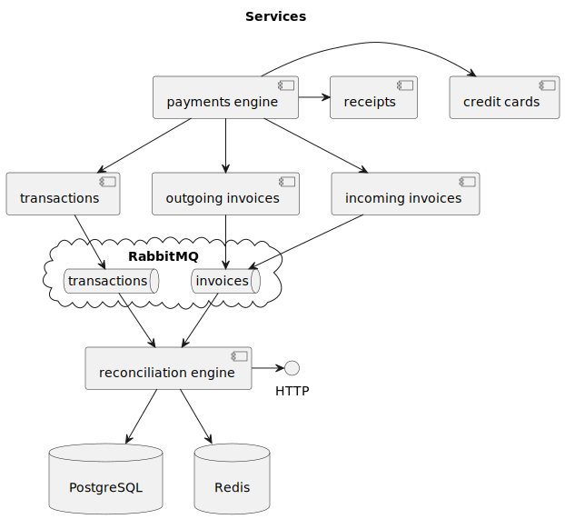

# case-study

## Task

[Task](task.md)

## Business process

### Entities

- Transaction (incoming/outgoing)
- Invoice (incoming/outgoing)

Incoming transactions are matched against outgoing invoices and vice versa.

### Many-to-many relation

- Invoice may be completed by one transaction
- Invoice may be completed by two or more transactions
- One transaction may complete several invoices

## Architecture

The main focus is (eventual) data consistency. It means that we are not allowed to lose any data.

### Services

Reconciliation engine is a service which listens events from other services via RabbitMQ. Each event triggers matching
process. Connections between transactions and invoices are stored in DB.

### Tech stack

- Kubernetes
- PostgreSQL
    - Default choice for relational DB
- Redis
    - May be used as a cache to reduce database load
- RabbitMQ
    - Messages are processed independent with retries (unlike Apache Kafka, for example)
- Code generated clients/servers based on OpenAPI (or Protobuf)

### Patterns

- Database per service
- Transactional outbox + publisher confirms (to guarantee delivery of all updates)
- Idempotent operations + at least once delivery (to process all events)

### Reconciliation engine API

- Get transaction IDs for invoice by ID
- Get invoice IDs for transaction by ID
- Get unmatched (or partially matched) transactions
- Get unmatched (or partially matched) invoices

### Reconciliation DB

#### Transaction

- id
- type (incoming/outgoing)
- amount
- invoice_ids (array from transactions service)

#### Invoice

- id
- type (incoming/outgoing)
- amount
- transaction_ids (array generated by reconciliation service for queries optimisations)
